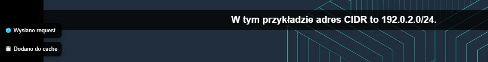
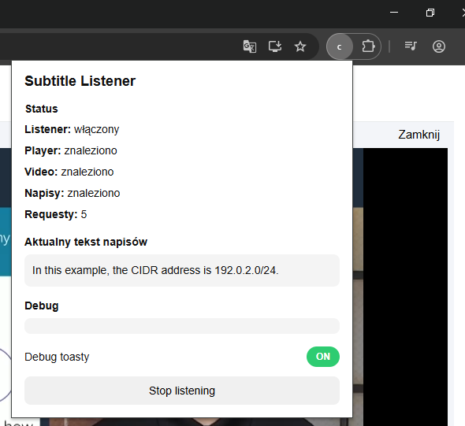

# chrome-subtitle-translator-pl

Chrome extension that detects video subtitles on AWS Academy and displays real-time Polish translations directly on the video.

---

## Preview

### Overlay (translated subtitles)

### Extension popup

---

## Features

* detects video player and subtitle container in AWS Academy
* reads current subtitle text from the DOM
* translates subtitles from English to Polish (Google Translate endpoint)
* in-memory cache to avoid duplicate requests
* sentence buffering for improved translation quality
* custom overlay displayed on top of the video
* hides original subtitles while overlay is active
* request counter (per session)
* optional debug toasts (toggle ON/OFF)
* works across nested iframes (Canvas LMS / SCORM)

---

## How it works

1. The extension injects a script into all frames
2. It locates the video player and subtitle container
3. A MutationObserver listens for subtitle updates
4. Text is buffered into more complete sentences
5. The sentence is translated using a Google endpoint
6. The result is cached and displayed in a custom overlay

---

## Limitations

* uses an unofficial Google Translate endpoint

  * may be rate-limited
  * not guaranteed to be stable
* cache is in-memory only
* small delay may occur before translation appears
* depends on subtitles being present in the DOM

---

## Supported environment

* AWS Academy (Canvas LMS with SCORM player)

---

## Development

### Run locally

1. Clone the repository
2. Open `chrome://extensions/`
3. Enable Developer mode
4. Click "Load unpacked"
5. Select the project folder

---

## Disclaimer

This project is not affiliated with or endorsed by Amazon or AWS.
